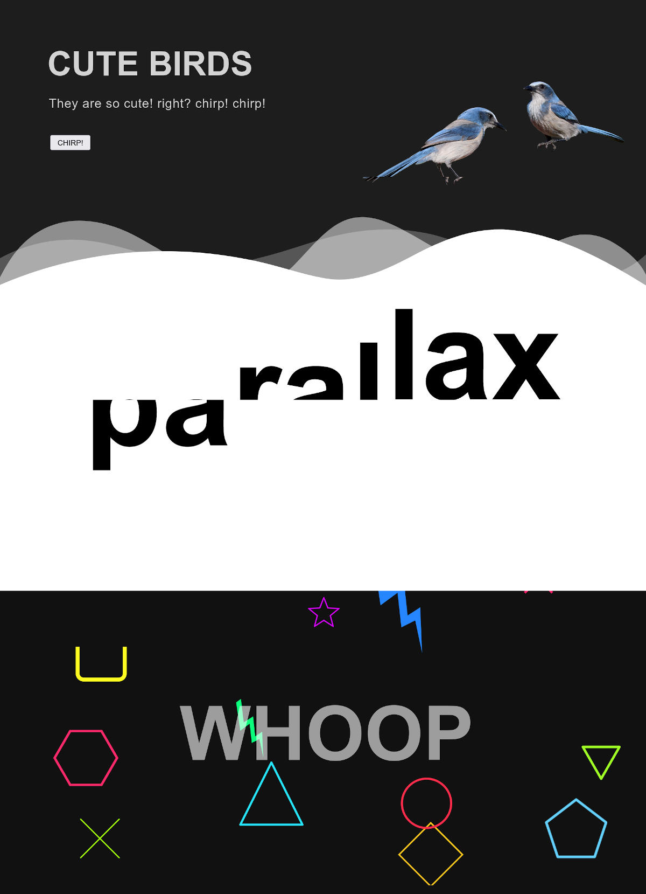

## DESCRIPTION:
- A simple UI: with parallax.
- [Youtube Video of the App](https://youtu.be/mg5F9RsaeHo)

## OUTCOME:
- Playing with Parallax for UI.
- link to the App's video on youtube: https://youtu.be/mg5F9RsaeHo

## TECH STACKS:
- HTML
- CSS with BEM naming convention.
- JavaScript
- Library : rellax.js

## PROGRESS:
- Done: 100%
- NOT mobile responsive.

## View other projects:
- [My Blog](https://hashnode.com/@marizoo)
- [My Pinterest](https://pin.it/16vGwjy)
- [My Youtube Channel](https://www.youtube.com/channel/UCfkbnM9WvHD3mjecBiGHCBQ/playlists)

## IMAGE:

